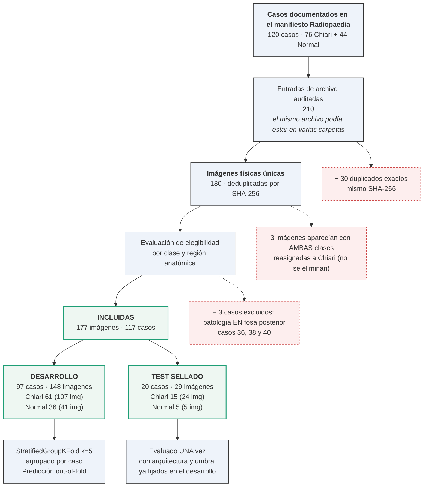
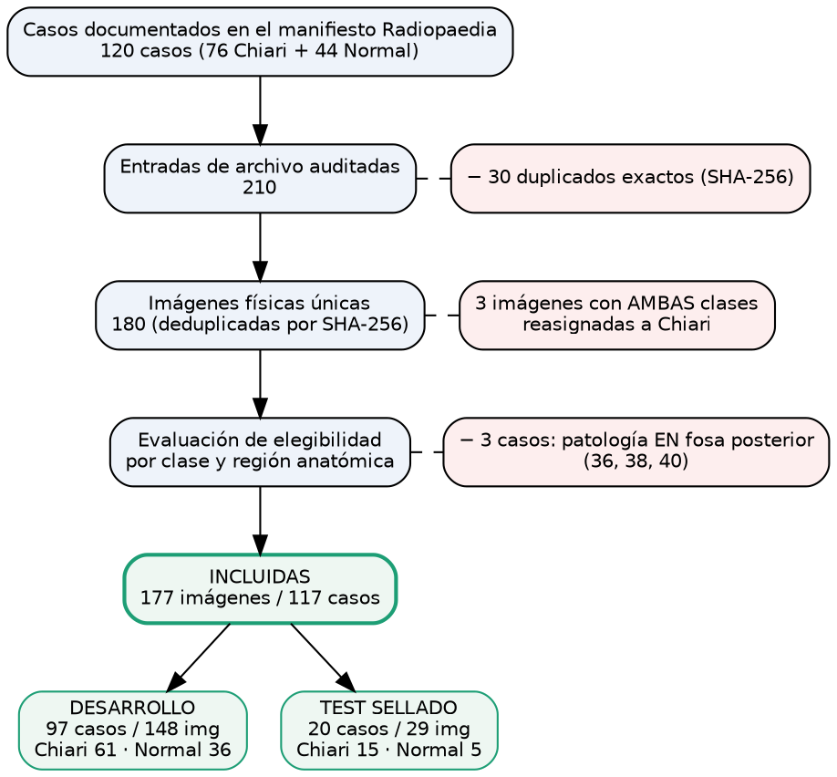
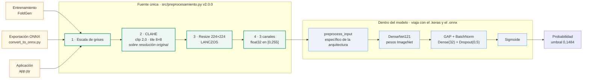
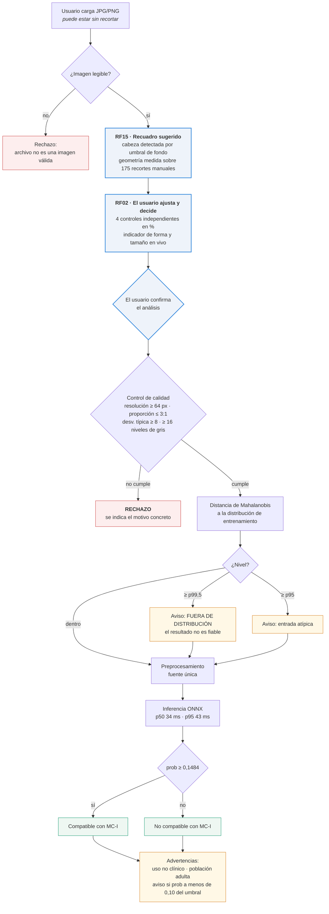
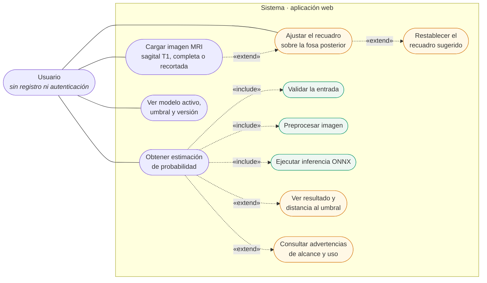
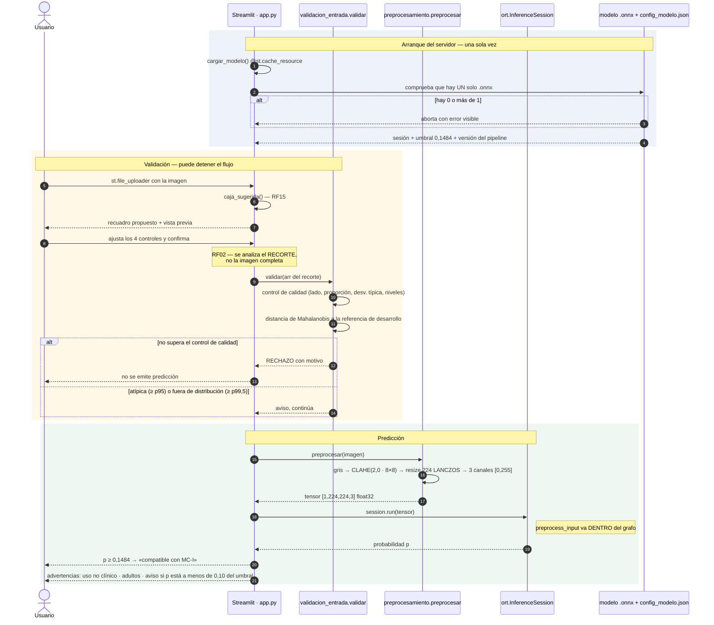
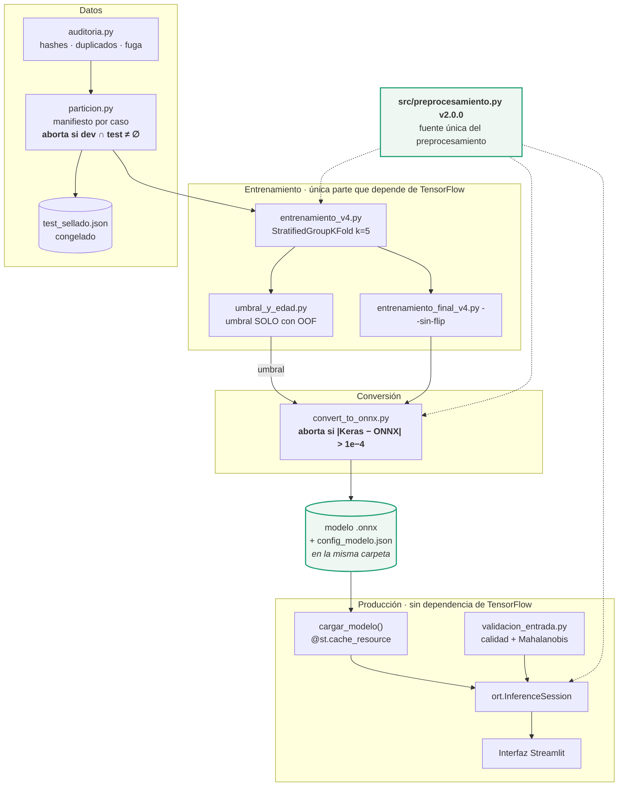
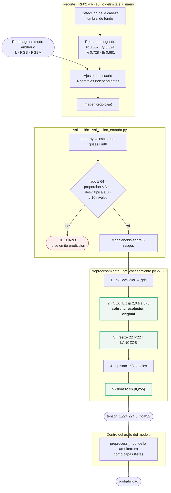

# Diagramas como código — para renderizar, no como imagen

Las cifras se leen de los artefactos del pipeline. Regenerable con `python src/diagramas_codigo.py`.

**Dónde pegarlo:** Mermaid en <https://mermaid.live> (también renderiza en GitHub, Notion y Obsidian). Graphviz en <https://dreampuf.github.io/GraphvizOnline> o con `dot -Tpng archivo.dot -o salida.png`.

---

## 1. Flujo de selección del conjunto de datos (CONSORT/STARD) — C-02

Para **Cap. 4 §4.2 Dataset**.

### Mermaid

### Graphviz (alternativa, mejor control del trazado)

---

## 2. Pipeline de preprocesamiento — C-06 / C-08

Para **Cap. 4 §4.2 Preprocesamiento**. Muestra que las tres rutas —entrenamiento, exportación y aplicación— convergen en la misma fuente, y que `preprocess_input` va dentro del modelo.

---

## 3. Flujo de la aplicación con validación de entrada — M-17 / M-18 / C-07

Para **Cap. 4 §4.4 Servicio web**. Incluye el control de calidad y la detección fuera de distribución.

---

## 4. Diagramas UML del libro que hay que rehacer

Las Figuras 10 a 13 del libro describen un sistema que ya no es el vigente: preprocesamiento en otro orden y otro rango, umbral 0,5, sin validación de entrada y con una promesa de «privacidad por diseño» que M-19 retira. Estos cuatro reemplazos mantienen el mismo tipo de diagrama UML y la misma numeración.

### 4.1 Casos de uso — reemplaza la Figura 10 (§4.4.4)

### 4.2 Secuencia del flujo de predicción — reemplaza la Figura 11 (§4.4.5)

### 4.3 Componentes — reemplaza la Figura 12 (§4.4.6)

### 4.4 Actividad de `preprocesar()` — reemplaza la Figura 13 (§4.4.7)

